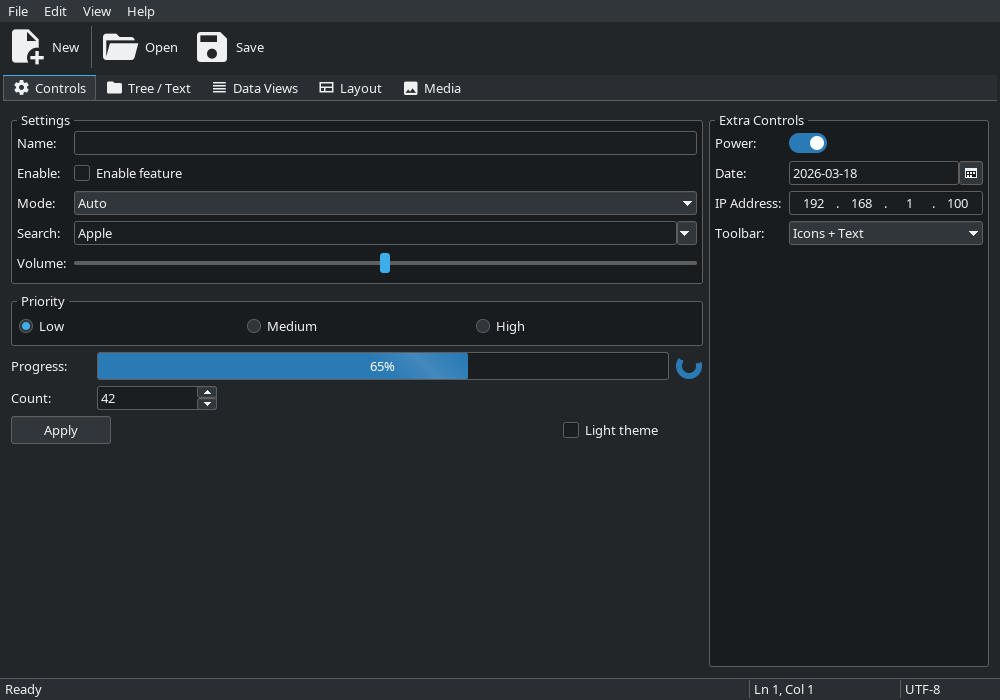
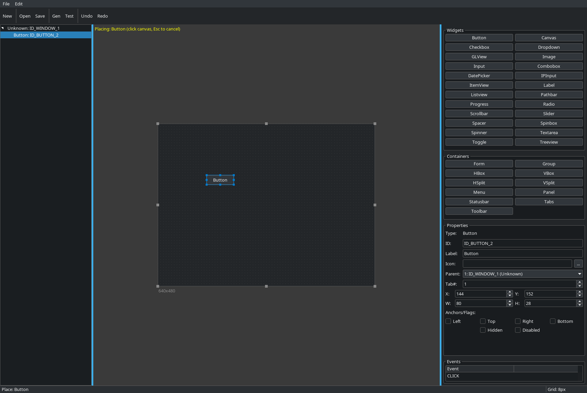

# mkgui

Minimal GUI toolkit for Linux (X11) and Windows (Win32). Software rendered, single-file unity build. Breeze-inspired styling. No third-party dependencies beyond FreeType2 and Xlib/GDI.

This is a personal project by a single developer. It works well for what it does, but it has not been exhaustively tested across every platform, hardware configuration, or edge case. Use it, enjoy it, file issues if something breaks -- but don't expect the test coverage of a toolkit backed by a corporation. There are no guarantees, no roadmap, and no promises.



## Features

- 45+ widget types: buttons, inputs, checkboxes, dropdowns, sliders, spinboxes, treeviews, listviews, gridviews, tabs, menus, toolbars, statusbars, toggles, comboboxes, datepickers, and more
- Auto-layout containers: VBox, HBox, Form, Group, Tabs, Splitters
- Software rendering via XShm (Linux) and GDI (Windows) -- no GPU required
- Built-in file dialogs, message boxes, input dialogs, color picker
- SVG icon system via PlutoSVG (Freedesktop icon naming, theme-aware monochrome)
- Toolbar display modes: icons only, text only, icons + text
- DPI scaling with auto-detection and `MKGUI_SCALE` environment variable override
- Keyboard accelerators with automatic menu shortcut display
- Undo/redo in text input and textarea widgets
- External file drag-and-drop (XDnd on Linux, WM_DROPFILES on Windows)
- Visual editor with drag-and-drop, property editing, and C code generation
- Unity build: `#include "mkgui.c"` and compile
- ~260KB stripped binary, ~5MB BSS, instant startup

## Visual editor



The editor generates complete, compilable C source files. Design your UI visually, set events, and hit Generate -- the output compiles and runs immediately.

See [documentation/editor.md](documentation/editor.md) for the full editor guide.

## Getting started

1. Copy the mkgui source into your project
2. `#include "mkgui.c"` in your application
3. Compile and link:
   ```bash
   # Linux
   gcc -std=c99 -O2 myapp.c -o myapp \
       $(pkg-config --cflags freetype2 fontconfig) -lX11 -lXext \
       $(pkg-config --libs freetype2 fontconfig) -lm

   # Windows (MinGW)
   x86_64-w64-mingw32-gcc -std=c99 -O2 myapp.c -o myapp.exe -lgdi32 -mwindows
   ```
4. Place an `icons/` directory next to your executable with SVG icons (see Icon section below)

OpenGL is only required if the application uses the `MKGUI_GLVIEW` widget (add `-lGL` on Linux or `-lopengl32` on Windows). The core library, editor, and all other widgets have no GPU dependency.

## Quick example

```c
#include "mkgui.c"

enum { ID_WIN = 0, ID_BTN = 1, ID_LBL = 2 };

static void on_event(struct mkgui_ctx *ctx, struct mkgui_event *ev, void *userdata) {
    (void)userdata;
    switch(ev->type) {
        case MKGUI_EVENT_CLOSE: {
            mkgui_quit(ctx);
        } break;

        case MKGUI_EVENT_CLICK: {
            if(ev->id == ID_BTN) {
                mkgui_label_set(ctx, ID_LBL, "Clicked!");
            }
        } break;
    }
}

int main(void) {
    struct mkgui_widget widgets[] = {
        MKGUI_W(MKGUI_WINDOW, ID_WIN, "Hello", "", 0,      400, 300, 0, 0, 0),
        MKGUI_W(MKGUI_BUTTON, ID_BTN, "Click", "", ID_WIN, 100, 0, MKGUI_FIXED, 0, 0),
        MKGUI_W(MKGUI_LABEL,  ID_LBL, "Ready", "", ID_WIN, 0, 0, 0, 0, 0),
    };

    struct mkgui_ctx *ctx = mkgui_create(widgets, 3);
    if(!ctx) return 1;

    mkgui_run(ctx, on_event, NULL);
    mkgui_destroy(ctx);
    return 0;
}
```

## Icons

mkgui uses SVG icons via PlutoSVG, following the Freedesktop icon naming standard. Icons are loaded at runtime from a flat directory:

```c
mkgui_icon_load_svg_dir(ctx, "icons");           // load all SVGs from icons/
mkgui_icon_load_svg(ctx, "my-icon", "path.svg"); // load a single icon
```

Monochrome icons using `currentColor` automatically follow the theme text color and update on theme switch.

To extract icons from an installed Freedesktop icon theme (e.g. Papirus, Breeze):

```bash
./tools/extract_icons /usr/share/icons/Papirus icons/ tools/subset.txt
```

This extracts small (16/18px) and toolbar (22px) icons listed in `subset.txt` into the `icons/` directory. Toolbar-size icons go into `icons/toolbar/`.

## Building the demo and editor

```bash
./build.sh          # normal (debug symbols)
./build.sh release  # optimized, stripped
./build.sh debug    # -g -O0
```

## Building on Windows

mkgui requires GCC (C99). It does not compile with MSVC (`cl.exe`).

The easiest option is **MSYS2**, which gives you a native MinGW GCC on Windows:

1. Install [MSYS2](https://www.msys2.org/)
2. Open the **MSYS2 UCRT64** terminal
3. Install the toolchain and FreeType:
   ```bash
   pacman -S mingw-w64-ucrt-x86_64-gcc mingw-w64-ucrt-x86_64-freetype
   ```
4. Build your application (Windows uses GDI for fonts, so no fontconfig is needed):
   ```bash
   gcc -std=c99 -O2 myapp.c -o myapp.exe -lgdi32 -mwindows
   ```
   Add `-lopengl32` only if the application uses `MKGUI_GLVIEW`. Building `demo.c` requires `-lopengl32` since the demo showcases the GL view widget.

Alternatively, if you already use **WSL2** on Windows, just build the Linux version -- it runs natively under WSL2 with X11 forwarding or WSLg.

Cross-compiling from Linux also works. The included `build.sh` automatically builds Windows executables if `x86_64-w64-mingw32-gcc` is available.

## Documentation

- [API reference and widget guide](documentation/doc.md)
- [Visual editor guide](documentation/editor.md)
- [Adding new widgets](documentation/adding_widgets.md)

## Limitations

- Latin-1 (ISO 8859-1) text only -- covers Western European languages. No CJK, Arabic, or complex text shaping
- No right-to-left (RTL) layout support
- No accessibility API integration (tab navigation and keyboard accelerators are supported)

## License

MIT
